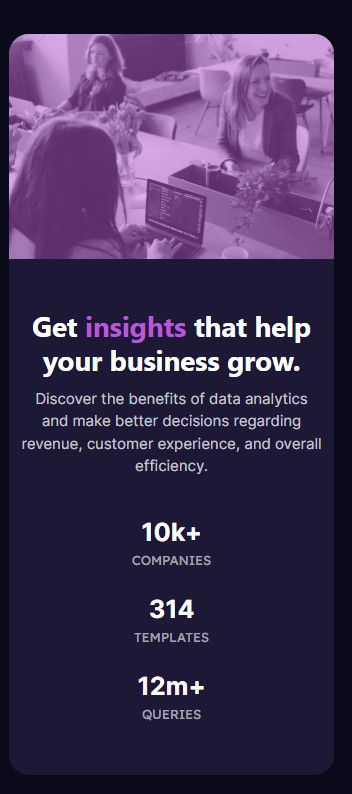

# Frontend Mentor - Stats preview card component solution

This is a solution to the [Stats preview card component challenge on Frontend Mentor](https://www.frontendmentor.io/challenges/stats-preview-card-component-8JqbgoU62). Frontend Mentor challenges help you improve your coding skills by building realistic projects.

## Table of contents

- [Overview](#overview)
  - [The challenge](#the-challenge)
  - [Screenshot](#screenshot)
  - [Links](#links)
- [My process](#my-process)
  - [Built with](#built-with)
  - [What I learned](#what-i-learned)
  - [Continued development](#continued-development)
- [Author](#author)

## Overview

### The challenge

Users should be able to:

- View the optimal layout depending on their device's screen size

### Screenshot

### Links

- Solution URL: [Solution URL here](https://github.com/ArteiusWorkshop/FM-stats-preview-card-component-main)
- Live Site URL: [Live site URL here](https://fm-stats-preview-card-component-main-kfys6d2nl-arteiusworkshop.vercel.app/)

## My process

### Built with

- Semantic HTML5 markup
- CSS custom properties
- Flexbox
- Bootstrap 5

### What I learned

Since 2010 that I do not use pure HTML and CSS for a whole website, page in this case. Learned how to work around this.

### Continued development

-HTML and CSS without a framework

## Author

- Frontend Mentor - [@yourusername](https://www.frontendmentor.io/profile/ArteiusWasTaken)
